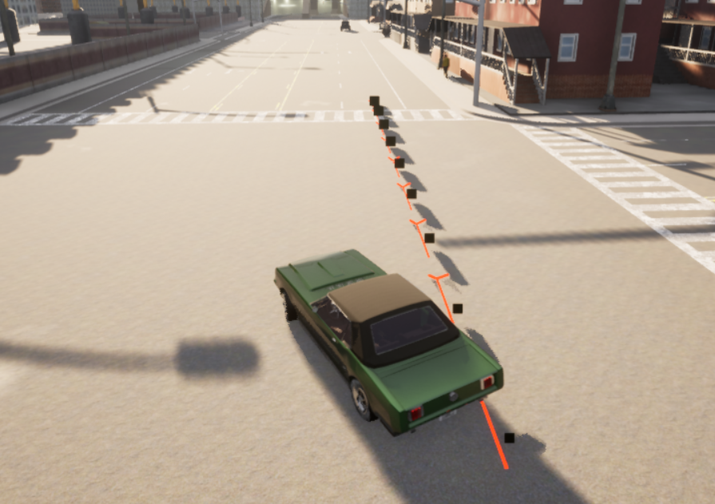
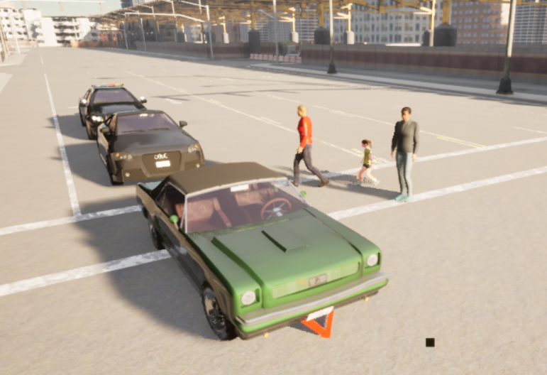
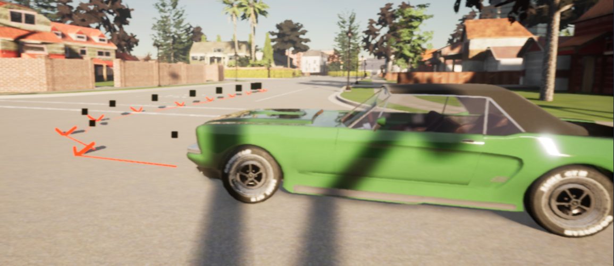

# CARLA Junction Turn RL Model Project
Autonomous Systems Workshop - Open University of Israel 2025b

## Description
This project is designed to train a vehicle to autonomously perform junction turns in a simulated environment using an reinforcement learning neural network, whilst adhereing to the SOLID code framework principles.

## Installation guide
#### Requirements
- CARLA v0.9.10
- Python v3.7.16 (conda virtual environment highly recommended)
- GPU with > 3GB VRAM

### Installing the project
1. Download CARLA v0.9.10 package from [github](https://github.com/carla-simulator/carla/releases/tag/0.9.10)
2. Place this workshop project dir in the root CARLA package path
3. Activate Python v3.7.16 virtual environment (`conda create -n carla_0.9.10 python=3.7 && conda activate carla_0.9.10`)
4. `pip install pygame numpy`
5. Install .egg file at `WindowsNoEditor\PythonAPI\carla\dist\carla-0.9.10-py3.7-win-amd64.egg` ([link](https://superuser.com/questions/445062/how-exactly-does-one-install-egg-files) for .egg files installation guide)
6. In workshop dir run `pip install -r "requirements.txt"`
7. Perhaps you will be required to install additional packages, for certainty install all `PythonAPI/*/requirements.txt` files

### Running the project
1. In powershell terminal execute `.\CarlaUE4.exe -quality-level=Low` from the root CARLA package directory (`-quality-level` parameter is optional but recommended for non high-end GPUs)
2. In a seperate shell ensure you are running in the virtual environment
3. Adjust the desirable configuration parameters in *`root/workshop/config.yml`*
4. Run `python main.py` for train/test session or `python main.py --help` to see running options. For project evaluation ensure config file is set for testing `config.runtime.mode == test` otherwise you will begin training the model

#### Authors
* [Boris Berezner](https://www.linkedin.com/in/boris-berezner-515299113/)
* Aviad Schweber